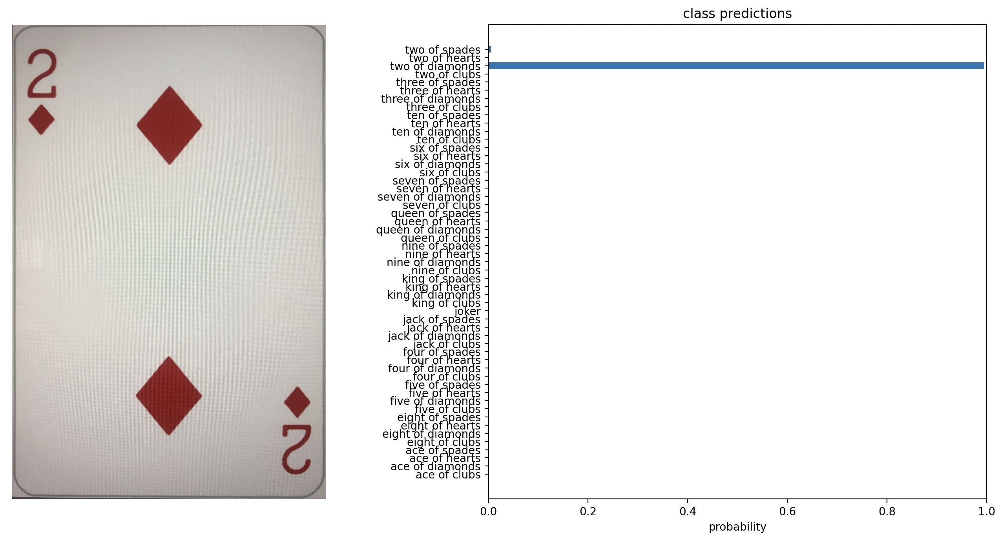

# nn-playingcards

classify images using [pytorch on apple silicon hardware](https://developer.apple.com/metal/pytorch).

required: [pytorch](https://pytorch.org/) incl. [torchvision](https://pytorch.org/vision), [timm](https://github.com/huggingface/pytorch-image-models) and [mpl](https://matplotlib.org/).

```
pip3 install torch torchvision timm matplotlib
```

download the playingcards [here](https://github.com/xeaydin/Card-Image-Classification/tree/master/Dataset) and adjust `cards_folder` accordingly

## training

adjust `num_epochs` (more is better but takes longer)

run `playingcards_training.py`

training state will be saved to `playingcards_trainstate.pt`

## inference

run `playingcards_classify.py <IMAGEFILE>`

example output:



## performance

training on the M2 macbook:

__cpu__: 875 sec per epoch

__mps__: 47 sec per epoch

mps is __≈18 times faster__ than cpu.
